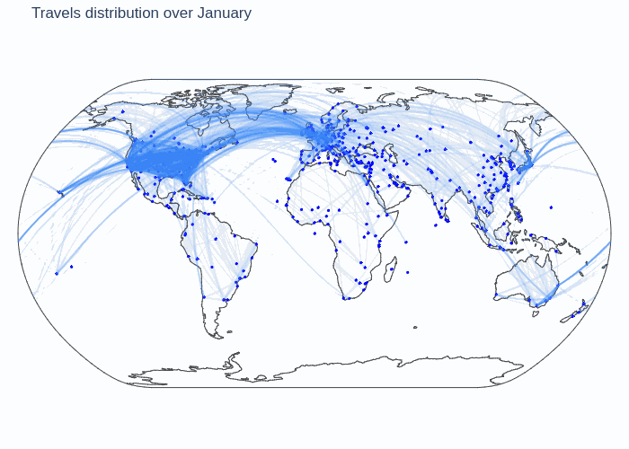

# Introduction
Early 2000, fews crimes were commited inside airports. To elucidate this mystery and finally find who is responsable of those terrible acts, the mondial government called the most qualified team: the one and only Sherlock Holmes, his little sister Enola Holmes, and his best friend the Doctor Watson.

