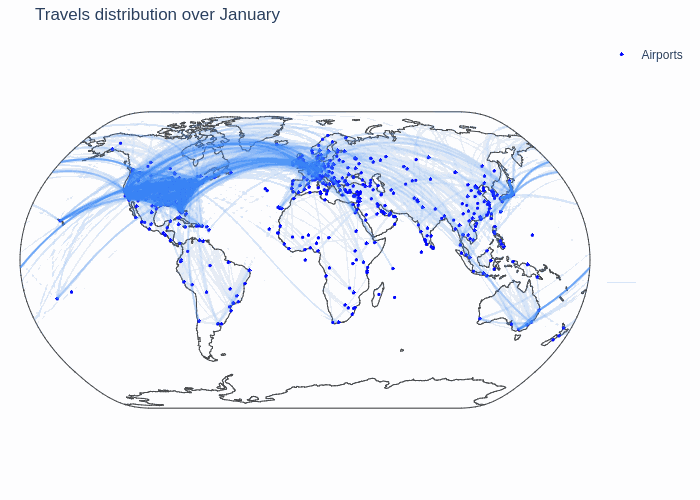

## ***Chapter 0: Introduction***

Early 2000s, all the front pages of the news papers are covered by the same story: few crimes were commited inside different airports all around the world: John F. Kennedy International Airport, Sydney Kingsford Smith Airport, Cointrin Geneva Airport.. and the list is long. It seems that to achieve some many, the guily has partners. 

It's been months now that the first crime has been done and that this tragedy continue. People start to be scared to take the plane and the airlines company are worrying about their futur. 

October 14st, 2010, all of those company have met in order to find a solution and stop this story. They ordered to the mondial government to call the most qualified team to elucidate this mystery and finally find who is responsable of those terrible acts. The government had no choice than calling the most qualified known team in terms of discovering mystery: the one and only Sherlock Holmes along with his little sister Enola Holmes, and his best friend the Doctor Watson.

To solve it, they dispose of the check-ins and the contacts of all the people which are considerate as "possible guilties" from approximately a year before the tragedy has started, until the big meeting of the airline companies.

Will this be enough to discover who's the one?

## ***Chapitre 1: How Sherlock and his team has proceeded to solve the mystery***

### ***Chapitre 1.1: Background***
#### ***Visualize how the possible guilties are distributed over the world***

Thanks to the check-ins of the people, they have computed approximately their homes, by discretizing the world into 25km2 cells, and taking the average of the check-ins inside the cell which contains most of them. The following picture shows all of them, with a color scale to show better the density: we can see that the two North American coasts as well as Europe and Japan are really dense. 

  <iframe style="margin:auto;display:block;" src="assets/homes_map.html" width="90%" height="600" frameborder="0" style="border:0" allowfullscreen></iframe>

#### ***Vizualize the pattern of how do the possible guilties move over the world***

Still using the check-ins of the possible guilties, they only kept pairs of check-ins which represents a travel by plane. How did they manage to do that? First they  only kept the one which are less than 1000km from an airport. Then they had to order chronologically all the check-in by person. Finally they kept all the pair of a check-in with the following one only if the distance between their respective closest airports was greater of 500km: they assumed that this threshold is large enough to consider that the person took the plane between them. \
In the following gif, they showed the air trafic according to the different months of the year. We can see that there are severaly big nodes which are mainly in the east North American coast, and in the center of Europe.

Ajouter la courbe travel / mois (total et par country) --> que doit faire Apo + description

At this point, Sherlock and his team have a good background of where could live the real guilties and to what looks like the air traffic during those terrible months.

### ***Chapter 1.2: Analysis***
#### ***Analyse which are the top 10 countries to which the possible guilties travel based on their own country***

TODO

<iframe src="assets/top10visited.html" width="100%" height="500" frameborder="0" style="border:0" allowfullscreen></iframe>

#### ***Analyse which are the top 10 countries where live the contacts of the possible guilties based on their own country***

Now that we have the top 10 countries to which the possible guilties travel based on their own country, they tought to find some informations about where live the contacts of the possible guilties in order to guess who are the partners in crime of the guilty once they will find it.
To do so, they found for each possible guilties the country where they live based on their home. Then, thanks to the contact network they have been given, they manage to obtained the top 10 countries where live the contacts of the possible guilties based on their own country. 

<iframe src="assets/top10friends.html" width="100%" height="500" frameborder="0" style="border:0" allowfullscreen></iframe>

### ***Chapter 1.3: Prediction***

Here they applied three different classification algorithms for a problem of 3 balanced classes. Since classes are balanced and having false positives or negatives does not impact differently the results, they consider that accuracy is a good measure here of how the algorithms perform.

Predicting at random would yield an accuracy of 33%. Here they obtained an accuracy of 47% which is slightly better than random predictions. This implies that predicting the continent where a user lives is possible using travel patterns over a year, but our data does not mark enough differences between continents. In order to validate if it is possible, they would need more balanced data between continents in the checkins.

 <h2>About the team </h2> 

Sherlock Holmes            |  Enola Holmes             | Doctor Watson            |
:-------------------------:|:-------------------------:|:-------------------------:
   | |
:-------------------------:|:-------------------------:|:-------------------------:
 Valentin Garnier          | Maina Orchampt-Mareschal  | Alexander Apostolov                       

 

   
