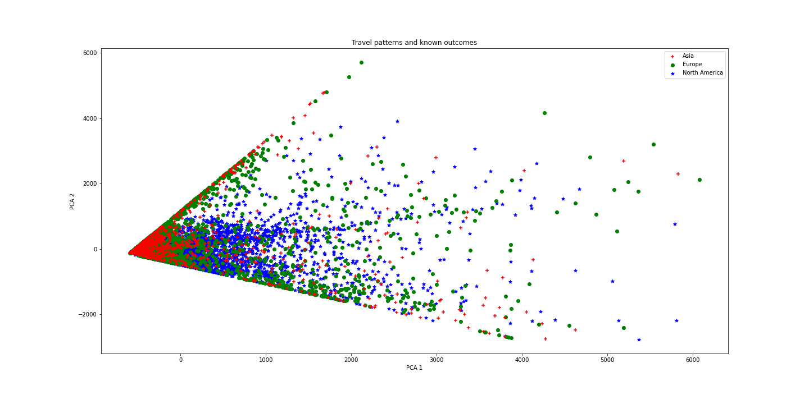

## Introduction

Early 2000s, all the front pages of the news papers are covered by the same story: crimes are commited different airports all around the world: John F. Kennedy International Airport, Sydney Kingsford Smith Airport, Cointrin Geneva Airport.. and the list is long. It seems some criminal dark mind is flying around the world to murder people. 

It has been months now that the first crimes have been comitted and that the tragedies continue. People start being scared to take planes and the airline companies are worrying about their futur. 

October 14st, 2010, all airlines companies gather together to find a solution and stop this macabre trend. They decide to take rational actions and call the most qualified team to elucidate this mystery and finally find who is responsable of those terrible acts. They obviously call the most qualified known team in terms of discovering mysteries: the one and only Sherlock Holmes along with his little sister Enola Holmes, and his best friend Doctor Watson.

Fortunately, the team has taken the ADA course from EPFL and they have a large collection of data about people's movements around the world. Enola Holmes proposes to analyze this data to get insights about plane travels globally and use it to help them catch the murderer and his potential associates before they strike again.

Will this be enough to discover who's the one?

## How Sherlock and his team (we) have proceeded to solve the mystery

### Goals

### Key findings

### Data at our disposal

The data we have at our disposal represents over 10 million check-ins of 1.2 million users of the apps Gowalla and Brightkite. Each check-in represents a time a user has used the app and his or her GPS coordinates were recorded along with a timestamp.

Thanks to these check-ins, we have estimated their homes, by discretizing the world into 25km2 cells, and taking the average of the check-ins inside the cell which contains most of them. We do this in two steps as there can be users who have been to multiple places around the world for holidays or work and we do not want to just take the avergae of all their check-ins. For example, if we just did the global average, a user that lives in Switzerland and has been to a long duration trip in Tahiti for the holidays would have his home estimated somewhere in the ocean around South America. By first taking the cell where the user has been the most, we can then confidently take the average without having too much of a bias. 

The following map shows all estimated homes, with a color scale representing their density. Warm colors represent areas with a high density of homes, whereas cold colors represent areas with a scarse density of homes. 

  <iframe style="margin:auto;display:block;" src="assets/homes_map.html" width="90%" height="600" frameborder="0" style="border:0" allowfullscreen></iframe>

By looking at the interactive map above, we can see that the density of our data is far from being uniformly spread around the world. There are some areas of the world such as Central Africa and Central Asia which are almost not covered. We see that most users we are considering are living in North America, Europe and Japan. 

This fact should be considered in the subsequent analysis we do as it is based on data mainly covering specific and one can even argue similar areas of the world. 
Indeed, we might, as a lot of research in the scientific litterature, suffer from a [WEIRD (Western, educated, industrialized, rich and democratic) bias](https://www.apa.org/monitor/2010/05/weird). For example, it is quite probable that potential users that are not covered in our data and do not come from WEIRD countries will have other patterns in their long distance travels.
The results we state should thus be taken with a grain of salt. 

### How to detect plane travels 

We now want to detect plane travels from the check-ins we have. To do so we look at all the check-ins of each user and consider all pairs of consecutive check-ins that are far enough as a plane trip. An important parameter we need to consider is what distance to use as a threshold to determine if two check-ins are distant enough. After trying different values we decide to use 500km as minimum distance. Indeed, we think that it is really likely that a majority of trips longer than this are done by plane. 
To make our analysis even more precise we decide to detect the airports used at the beginning and end of each trip. To do so we take a list of all airports in the world and determine the closest one to the each check-in right before and after the detected long-distance trips. As our list of airports contains very precise data (airports, small airports, aerodromes, heliports, military bases, etc...) we decide to only consider large airports as these are the ones used by most commercial airline companies for their regular trips.  

Below we show the distribution of distances between our estimated airports and the check-ins that happen just before and after a trip.

<iframe src="assets/histogram_distances_airports.html" width="100%" height="500" frameborder="0" style="border:0" allowfullscreen></iframe>

We see that our estimation works well, indeed most check-ins before and after a long distance trip are usually close to airports. However we see there are some outliers after 1000km which are very far from airports for their long-distance trips. After analyzing those we realize they are mainly a few trips to really remote part of the world such as Antarctica and the Arctic and some remote islands without large airports. Because these represent only a small proportion of detected trips we safely ignore them.

After doing this we get the information for 24'243 trips made by plane between 606 airports worldwide.

### Which countries travel the most?

Now that we have detected plane travels, we want to see which countries have residents travelling the most. As this question can be interpreted differently, we will use two metrics, travelled distance and number of flights to be as thorough as possible. To have comparable data, we normalize it temporally to have the flown distance and number of flights over a year and then we divide the results by the amount of users per country, so that our metrics correspond to an average year for an average user of each country.

Below, we show the top 10 countries according to each metric:

  **<u>Top 10 countries flying the biggest distance per year</u>**

  
<table align="center">
  <thead>
    <tr>
      <th style="text-align:center">N°</th>
      <th style="text-align:center">Country</th>
      <th style="text-align:center">Travelled distance over a year</th>
      <th style="text-align:center">GDP per capita ranking (IMF)</th>
    </tr>
  </thead>
  <tbody>
    <tr>
      <td style="text-align:center">1</td>
      <td style="text-align:center">Sweden</td>
      <td style="text-align:center">21&#39;537</td>
      <td style="text-align:center">12</td>
    </tr>
    <tr>
      <td style="text-align:center">2</td>
      <td style="text-align:center">Singapor</td>
      <td style="text-align:center">10&#39;064</td>
      <td style="text-align:center">6</td>
    </tr>
    <tr>
      <td style="text-align:center">3</td>
      <td style="text-align:center">Switzerland</td>
      <td style="text-align:center">8&#39;903</td>
      <td style="text-align:center">2</td>
    </tr>
    <tr>
      <td style="text-align:center">4</td>
      <td style="text-align:center">Norway</td>
      <td style="text-align:center">7&#39;971</td>
      <td style="text-align:center">4</td>
    </tr>
    <tr>
      <td style="text-align:center">5</td>
      <td style="text-align:center">Austria</td>
      <td style="text-align:center">6&#39;476</td>
      <td style="text-align:center">13</td>
    </tr>
    <tr>
      <td style="text-align:center">6</td>
      <td style="text-align:center">The Philippines</td>
      <td style="text-align:center">6&#39;243</td>
      <td style="text-align:center">119</td>
    </tr>
    <tr>
      <td style="text-align:center">7</td>
      <td style="text-align:center">Belgium</td>
      <td style="text-align:center">6&#39;214</td>
      <td style="text-align:center">16</td>
    </tr>
    <tr>
      <td style="text-align:center">8</td>
      <td style="text-align:center">United States</td>
      <td style="text-align:center">5&#39;549</td>
      <td style="text-align:center">5</td>
    </tr>
    <tr>
      <td style="text-align:center">9</td>
      <td style="text-align:center">China</td>
      <td style="text-align:center">4&#39;931</td>
      <td style="text-align:center">59</td>
    </tr>
    <tr>
      <td style="text-align:center">10</td>
      <td style="text-align:center">Australia</td>
      <td style="text-align:center">4&#39;919</td>
      <td style="text-align:center">10</td>
    </tr>
  </tbody>
</table>

  **<u>Top 10 countries flying the most trips per year</u>**

<table align="center">
  <thead>
    <tr>
      <th style="text-align:center">N°</th>
      <th style="text-align:center">Country</th>
      <th style="text-align:center">Travelled distance over a year</th>
      <th style="text-align:center">GDP per capita ranking (IMF)</th>
    </tr>
  </thead>
  <tbody>
    <tr>
      <td style="text-align:center">1</td>
      <td style="text-align:center">Sweden</td>
      <td style="text-align:center">10.1</td>
      <td style="text-align:center">12</td>
    </tr>
    <tr>
      <td style="text-align:center">2</td>
      <td style="text-align:center">Norway</td>
      <td style="text-align:center">3.8</td>
      <td style="text-align:center">4</td>
    </tr>
    <tr>
      <td style="text-align:center">3</td>
      <td style="text-align:center">Switzerland</td>
      <td style="text-align:center">3.1</td>
      <td style="text-align:center">2</td>
    </tr>
    <tr>
      <td style="text-align:center">4</td>
      <td style="text-align:center">United States</td>
      <td style="text-align:center">2.6</td>
      <td style="text-align:center">5</td>
    </tr>
    <tr>
      <td style="text-align:center">5</td>
      <td style="text-align:center">Austria</td>
      <td style="text-align:center">2.5</td>
      <td style="text-align:center">13</td>
    </tr>
    <tr>
      <td style="text-align:center">6</td>
      <td style="text-align:center">Belgium</td>
      <td style="text-align:center">2.4</td>
      <td style="text-align:center">16</td>
    </tr>
    <tr>
      <td style="text-align:center">7</td>
      <td style="text-align:center">Singapor</td>
      <td style="text-align:center">2.2</td>
      <td style="text-align:center">6</td>
    </tr>
    <tr>
      <td style="text-align:center">8</td>
      <td style="text-align:center">Germany</td>
      <td style="text-align:center">1.9</td>
      <td style="text-align:center">15</td>
    </tr>
    <tr>
      <td style="text-align:center">9</td>
      <td style="text-align:center">Denmark</td>
      <td style="text-align:center">1.8</td>
      <td style="text-align:center">7</td>
    </tr>
    <tr>
      <td style="text-align:center">10</td>
      <td style="text-align:center">Mexico</td>
      <td style="text-align:center">1.7</td>
      <td style="text-align:center">71</td>
    </tr>
  </tbody>
</table>

We notice something interesting when looking at the tables above, most present countries are also in the top 20 of GDP per capita according to the [International Monetary Fund (IMF)](https://en.wikipedia.org/wiki/List_of_countries_by_GDP_(nominal)_per_capita). This illustrates a correlation between the their economic well-being and their capacity to travel by plane. However, there are some outliers, in the first table we see that people living in The Philliines, even though they are ranked low in GDP per capita, are flying a lot of milleage. This is not surprising since their country is made of 7'000 islands in the ocean, so every time they travel they need to cross the waters around them in order to reach any destination. This intrinsic way of travelling will naturally increase the flown distance more rapidely than a landlock country such as Switzerland, even though they travel a bit less frequently (N° 14 in most trips per year). We also see that people living in China, are not in the top travellers by number of flights (N°15  in most trips per year) but tend to fly further,  similarly to people from The Philippines. The average Chinese user is thus flying less frequently but further. For Mexico, we see the opposite trend, they fly more frequently but shorter distances (N° 20 in furtest distance by year). This might be due to the fact that their country is large enough so that they take short domestic flights which are cheaper than long international flights.

### Vizualize the pattern of how people move over the world over time

We now want to see how these two metrics evolve throughout the year. We look at the variation between months of the year in this section.

First, we show the following GIF that depicts all airports and the number of flights connecting them throughout a month. The darker the link between them, the more connected the airports for the given month.

  

We can see that there are three big clusters for the global air traffic, North America, Europe and Eastern Asia. The airports in these clusters are strongly connected amongst themselves and the three big clusters are also well connected amongst themselves. This network can thus be considered as one with three big communities that are very dense and that are connected with so called *weak ties* which are significant.  
We also notice some varying trends throughout the year. It seems that there is more traffic in January and during the summer, but to be more certain about this claim we make a more granular analysis.

We first look at the distance travelled by month. The following bar plot shows how an average user travels throughout the year. We should note that this might be a bit biased towards the US as it is the country with the most users.

  <iframe style="margin:auto;display:block;" src="assets/global_distance_travelled.html" width="60%" height="600" frameborder="0" style="border:0" allowfullscreen></iframe>

We see that there is a significant increase in flown distance between May and October as we saw in the animation above. This might be explained because it is usually a time of the year when  lot of people we have represented in the data (North America and Europe) have summer holidays andthus the time to go on longer trips further. However we do not see the increase of traffic in January on this gloabl trend. To look into more details we analyze the trend per country:

  <iframe style="margin:auto;display:block;" src="assets/distance_travelled.html" width="90%" height="600" frameborder="0" style="border:0" allowfullscreen></iframe>

Here we see something interesting, there is a divide between countries in the Northern and Southern hemisphere of the globe. People living in Europe and North America tend to have a peak of travels in the summer months (June to September), while users from countries in the Southern hemisphere such as Australia, New Zealand, Brazil, Argentina or South Africa tend to have a peak in the first months of the year. This might be due to the fact that this corresponds to their summer and is when schools are on holidays and families tend to have more time to travel. This can also explain why we are seeing more traffic in the animated gif af air traffic above.

We now do the same analysis for the number of trips. We first show the gloabl trend:

  <iframe style="margin:auto;display:block;" src="assets/global_number_trips_travelled.html" width="60%" height="600" frameborder="0" style="border:0" allowfullscreen></iframe>

The trend we observe here is very similar to the one for the flown distance, meaning that the periods when user travel further are the same ones as the periods when user travel frequently. To see if we also see a North/South divide we show the data per country:

  <iframe style="margin:auto;display:block;" src="assets/number_trips_travelled.html" width="90%" height="600" frameborder="0" style="border:0" allowfullscreen></iframe>

As one could expect, we see the same trend appearing for the number of travels. 

### Analysis of the gloabal network of airports

We now would like to see how the airports are connected amongst themselves. The 606 form a graph which is interesting to analyze. First we note that all airports form one connected component, this means that it is possible from any airport to reach any other airport in the world. It is sometimes needed to do layovers through other airports but it is always possible to reach any final destination from any starting airport. We do not have a scenario where some subset of airports are fully separated from the rest. We use different metrics to measure how tightly interconnected the airports are. We first see that the average shortest path between two airports is 1.96. This means that going from any airport A to any airport B on the globe takes on average just below two trips. 

We are now interested to see what are the top 10 most important airports. For this we will use two metrics.  
First we look at the most connected airports, i.e. the airports from which you can reach the most other airports:

  **<u>Top 10 countries flying the most trips per year</u>**

<table>
  <thead>
    <tr>
     <th style="text-align:center">N°</th>
     <th style="text-align:center">Airport (Country)</th>
     <th style="text-align:center">Connected to</th>
    </tr>
  </thead>
  <tbody>
    <tr>
      <td style="text-align:center">1</td>
      <td style="text-align:center">La Guardia (US)</td>
      <td style="text-align:center">404</td>
    </tr>
    <tr>
      <td style="text-align:center">2</td>
      <td style="text-align:center">London Heathrow (GB)</td>
      <td style="text-align:center">379</td>
    </tr>
    <tr>
      <td style="text-align:center">3</td>
      <td style="text-align:center">San Francisco International (US)</td>
      <td style="text-align:center">361</td>
    </tr>
    <tr>
       <td style="text-align:center">4</td>
      <td style="text-align:center">Los Angeles International (US)</td>
      <td style="text-align:center">359</td>
    </tr>
    <tr>
      <td style="text-align:center">5</td>
      <td style="text-align:center">Denver International (US)</td>
      <td style="text-align:center">343</td>
    </tr>
    <tr>
      <td style="text-align:center">6</td>
      <td style="text-align:center">Stockholm-Arlanda (SW)</td>
      <td style="text-align:center">331</td>
    </tr>
    <tr>
      <td style="text-align:center">7</td>
      <td style="text-align:center">Norman Y. Mineta San Jose International (US)</td>
      <td style="text-align:center">328</td>
    </tr>
    <tr>
      <td style="text-align:center">8</td>
      <td style="text-align:center">Metropolitan Oakland International (US)</td>
       <td style="text-align:center">323</td>
    </tr>
    <tr>
      <td style="text-align:center">9</td>
      <td style="text-align:center">Austin Bergstrom International (US)</td>
      <td style="text-align:center">312</td>
    </tr>
    <tr>
      <td style="text-align:center">10</td>
      <td style="text-align:center">Tokyo Haneda International (JP)</td>
      <td style="text-align:center">290</td>
    </tr>
  </tbody>
</table>

We see that each one of the three big clusters we mentionned earlier (Nort America, Europe and Eastern Asia) in the air traffic animation has at least one airport that is really well connected to the rest of the network. We note that the United States is the country with the most connected airports.

Then we look at the betweeness of airports, this measure tells us which airports are used the most often to travel between any two random airports worldwide. 

<table align="center">
  <thead>
    <tr>
      <th style="text-align:center">N°</th>
      <th style="text-align:center">Airport (Country)</th>
      <th style="text-align:center">Betweeness score</th>
    </tr>
  </thead>
  <tbody>
    <tr>
      <td style="text-align:center">1</td>
      <td style="text-align:center">London Heathrow (GB)</td>
      <td style="text-align:center">0.044</td>
    </tr>
    <tr>
      <td style="text-align:center">2</td>
      <td style="text-align:center">La Guardia (US)</td>
      <td style="text-align:center">0.039</td>
    </tr>
    <tr>
      <td style="text-align:center">3</td>
      <td style="text-align:center">Stockholm-Arlanda (SW)</td>
      <td style="text-align:center">0.031</td>
    </tr>
    <tr>
      <td style="text-align:center">4</td>
      <td style="text-align:center">Los Angeles International (US)</td>
      <td style="text-align:center">0.027</td>
    </tr>
    <tr>
      <td style="text-align:center">5</td>
      <td style="text-align:center">San Francisco International (US)</td>
      <td style="text-align:center">0.025</td>
    </tr>
    <tr>
      <td style="text-align:center">6</td>
      <td style="text-align:center">Tokyo Haneda International (JP)</td>
      <td style="text-align:center">0.025</td>
    </tr>
    <tr>
      <td style="text-align:center">7</td>
      <td style="text-align:center">Denver International (US)</td>
      <td style="text-align:center">0.022</td>
    </tr>
    <tr>
      <td style="text-align:center">8</td>
      <td style="text-align:center">Norman Y. Mineta San Jose International (US)</td>
      <td style="text-align:center">0.022</td>
    </tr>
    <tr>
      <td style="text-align:center">9</td>
      <td style="text-align:center">Austin Bergstrom International (US)</td>
      <td style="text-align:center">0.016</td>
    </tr>
    <tr>
      <td style="text-align:center">10</td>
      <td style="text-align:center">Paris-Orly (FR)</td>
      <td style="text-align:center">0.016</td>
    </tr>
  </tbody>
</table>

In the table above when the airport has a high betweeness score, it is one of the modt frequently used when travelling between two airports with the least amounts of layovers. Not surprisingly, we see that most of the airport that have a very high betweeness score are also some of the most connected. We also see that each of the three clusters are represented in this table.

### Analyse which are the top 10 countries to which people travels based on their own country

TODO

<iframe src="assets/top10visited.html" width="100%" height="500" frameborder="0" style="border:0" allowfullscreen></iframe>

### Analyse which are the top 10 countries where live the contacts of the people based on their own country

Now that we have the top 10 countries to which the possible guilties travel based on their own country, we tought to find some informations about where live the contacts of the possible guilties in order to guess who are the partners in crime of the guilty once they will find him.
To do so, we found for each person the country where he lives based on his home. Then, thanks to the contact network we have, we manage to obtained the top 10 countries where live their contacts based on their own country. 

<iframe src="assets/top10friendships.html" width="100%" height="500" frameborder="0" style="border:0" allowfullscreen></iframe>

### Prediction

Finally, we check if it is possible to infer people’s home areas based on their flight patterns. Predicting the country home area is quite difficult because we have not enough data, and too much bias in it. In order to be more global, we decide to predict if a user lives in North America, Europe or Asia, the three most represented continents. For each continent, we picked users that travel the most so that they represent the most their home area, as some users of the app are not well presented in the flight data, as they might have not used it while travelling. 

As we have a lot of dimensions of informations for each user we use a common technique called [PCA](https://en.wikipedia.org/wiki/Principal_component_analysis) to reduce these dimensions to only two significant ones so we can plot the data and see how the three groups are spread.

  

We can observe a link between patterns and continents, so we now try to use machine learning techniques to predict the desired result.

Predicting at random between 3 continents would yield a score of 33%. We use a neural network to predict home area based on the number of trips and the distance traveled and we obtain an accuracy of 81.6%. This implies that predicting the continent where a user lives is possible using travel patterns over a year. This is very encouraging because with enough data representing the 3 main continents, our model can definitely predict in which continent a user lives based on his travel patterns. With more balanced data, it may even be possible to predict a user’s home country based on his flight patterns!

 <h2>About the team </h2> 

<table align="center">
  <thead>
    <tr>
      <th style="text-align:center">Sherlock Holmes</th>
      <th style="text-align:center">Enola Holmes</th>
      <th style="text-align:center">Doctor Watson</th>
    </tr>
  </thead>
  <tbody>
    <tr>
      <td style="text-align:center"></td>
      <td style="text-align:center"></td>
      <td></td>
   </tr>
  </tbody>
</table>              

 

   
